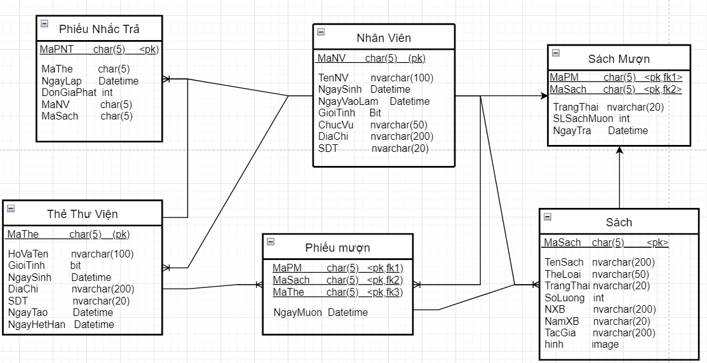

# software-technology
# Mô tả yêu cầu
- Chương trình quản lí thư viện bao gồm các chức năng cơ bản để thủ thư, người đọc có thể đễ dang tìm kiếm, mượn sách ở thư viện.
với các chức năng thêm, xóa, sửa, …
người quản lí có thể dễ dàng kiểm soát được số lượng sách, trạng thái của từng quyển sách đã mượn hoặc có sẳn.
# Giao Diện

 
